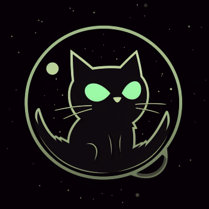

# Midnight Library
Midnight is a powerful library for Spigot plugins that simplifies the creation and management of various plugin features.

## Modules
* [`Midnight`](https://github.com/ColinGrime/Midnight/tree/master/midnight) - Main library with the majority of the features listed below.
* [`Midnight Channels`](https://github.com/ColinGrime/Midnight/tree/master/midnight-channels) - API for all chat-related actions.
* [`Midnight Particles`](https://github.com/ColinGrime/Midnight/tree/master/midnight-particles) - Contains all particle-related features.

## Feature List
* [`Channels`](https://github.com/ColinGrime/Midnight/wiki/Midnight-Channels)
* [`Commands`](https://github.com/ColinGrime/Midnight/wiki/Package-Commands)
* `Configuration`
* `Cooldown`
* `Display`
* `Expiring`
* `Geometry`
* `GUI`
* `Message`
* `Particles`
* `Scheduling`
* `Storage`

## Dependency
```groovy
repositories {
    maven { url 'https://jitpack.io' }
}

dependencies {
    compileOnly 'com.github.ColinGrime:Midnight:LATEST_VERSION'
}
```

